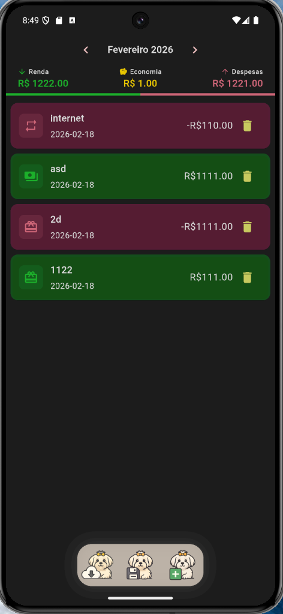
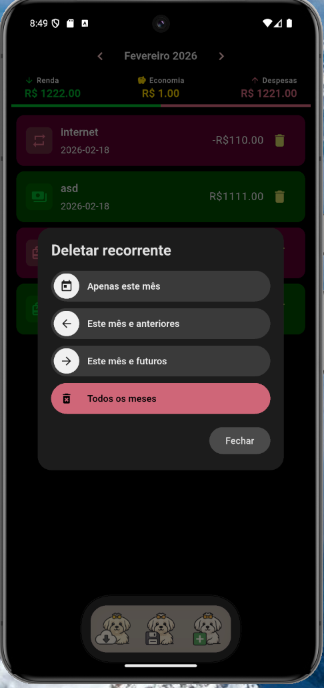

# RichLudo

<p align="center">
  
  
  
  
</p>

Personal finance control app, converted from the RichPipi project (Kotlin Multiplatform) to Flutter.

## Screenshots

<p align="center">
  
  &nbsp;&nbsp;
  
  &nbsp;&nbsp;
  
</p>

<p align="center">
  <sub>Tela principal · Formulário de transação · Deleção de recorrente</sub>
</p>

## Description - pt-br

Esse aplicativo foi criado por dois motivos.

O primeiro foi porque eu queria um aplicativo de gestão financeira que não fosse muito complexo, nem precisasse se conectar a muitas contas online, e também não tivesse muitas propagandas.

O segundo foi porque eu queria ver como seria desenvolver em uma plataforma que eu nunca havia trabalhado – mobile – e com uma linguagem que nunca havia usado – Dart.

A ideia era ver como eu me sairia apenas com conhecimentos básicos, como: arquitetura de sistemas, padrões de design, estruturas de dados etc.

Tudo isso, utilizando IA para impulsionar o aprendizado

## Description - en-us

This app was created for two reasons.

The first was because I wanted a financial management app that wasn't too complex, didn't need to connect to many online accounts, and also didn't have many ads.

The second was because I wanted to see what it would be like to develop on a platform I had never worked on – mobile – and with a language I had never used – Dart.

The idea was to see how I would fare using only basic knowledge, such as: system architecture, design patterns, data structures, etc.

All of this, using AI to boost learning.

## Architecture

This project follows partially **Clean Architecture** with the following layers:

### Domain Layer (Pure in Dart, no framework dependencies)
- **Models**: `Transaction`, `TransactionType`
- **Repository Interfaces**: `TransactionRepository`
- **Use Cases**: `GetTransactionsUseCase`, `MakeTransactionUseCase`, `DeleteTransactionUseCase`

### Data Layer
- **Local Database**: SQLite via `sqflite`
- **DAO**: `TransactionDao`
- **Repository Implementation**: `TransactionRepositoryImpl`

### Presentation Layer
- **ViewModels**: `MainScreenViewModel`, `TransactionFormViewModel` (using `ChangeNotifier`)
- **UI**: `MainScreen`, `TransactionDialog`
- **Theme**: Theme inspired by Maltese Dog with light/dark mode support

## Folder Structure

```
lib/
├── data/
│   ├── local/
│   │   ├── dao/
│   │   └── database/
│   └── repository/
├── domain/
│   ├── model/
│   ├── repository/
│   └── usecase/
├── l10n/
├── presentation/
│   ├── ui/
│   │   ├── screens/
│   │   ├── theme/
│   │   └── widgets/
│   └── viewmodel/
└── main.dart
```

## Features

- ✅ Add transactions (income and expenses)
- ✅ List transactions by month
- ✅ Navigate between months
- ✅ Calculate totals for income, expenses, and savings
- ✅ Support for recurring transactions
- ✅ Expense and income categories
- ✅ Local persistence with SQLite
- ✅ Automatic light/dark theme
- ✅ Localization in Portuguese
- ✅ Export/import database
- ✅ Income/expense proportional bar

## Compilation

This project is configured to compile **only for Android and iOS**.

### Signing (Android Release)

Release builds are signed with a fixed keystore to ensure consistent updates via Obtainium or sideloading.

**Local setup:**

1. Generate a keystore (once):
```bash
keytool -genkey -v -keystore android/upload-keystore.jks -keyalg RSA -keysize 2048 -validity 10000 -alias upload
```

2. Create `android/key.properties` from the template:
```bash
cp android/key.properties.example android/key.properties
```

3. Edit `android/key.properties` with your passwords.

> The keystore and `key.properties` are in `.gitignore` and **must never be committed**.

**GitHub Actions (CI/CD):**

Configure these secrets in your repository (Settings → Secrets and variables → Actions):

| Secret | Description |
|--------|-------------|
| `KEYSTORE_BASE64` | Base64-encoded keystore: `base64 -i android/upload-keystore.jks` |
| `KEYSTORE_PASSWORD` | Store password |
| `KEY_PASSWORD` | Key password |
| `KEY_ALIAS` | Key alias (default: `upload`) |

### Run

```bash
flutter pub get
flutter run
```

### Build Android

```bash
flutter build apk
```

### Build iOS

```bash
flutter build ios
```

## Dependencies

- `provider`: State management
- `sqflite`: SQLite database
- `flutter_localizations`: Internationalization
- `file_picker`: Data export/import
- `intl`: Internationalization utilities

## License

This project is licensed under the **GNU General Public License v3.0** — see the [LICENSE](LICENSE) file for details.
